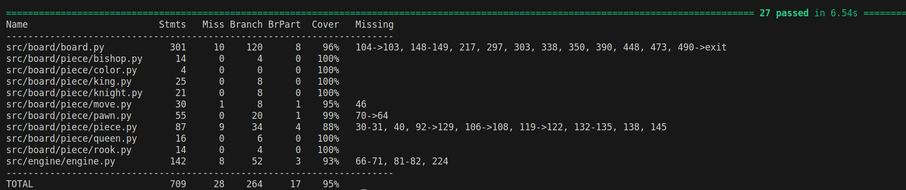

# Testausdokumentti

CI status: 

Tämänhetkinen testikattavuus: [](https://codecov.io/gh/volepp/algolabra-shakki)



## Testien kuvaus

Projektissa testataan ainoastaan pelilogiikaan ja tekoälyyn liittyviä moduuleita eli käytännössä kaikkea `board` ja `engine` moduuleihin sisältyvää. Lichess- ja Ascii-käyttöliittymiä, jotka ovat toteutettu pitkälti kolmannen osapuolen kirjastoja käyttäen, ei siis testata. 

Testit ajetaan CI:ssä automaattisesti ja testeistä generoidaan kattavuusraportti, joka ladataan Codecoviin. Tämän avulla Codecovista saadaan tietoa testikattavuudesta esimerkiksi README:n alkuun ja tähän dokumenttiin.

Tekoälyn testaamiseen on käytetty myös chess.com-sivustolta otettuja puzzle-harjoituksia. Kyseessä on lyhyitä, muutaman siirron sarjoja, jotka johtavat pelaajan voittoon tai voittavaan positioon pääsemiseen. Puzzleista saa hyviä testejä, sillä niihin on objektiivisesti vain yksi oikea vastaus. Tällä hetkellä käytetyt puzzlet ovat erilaisia pakotettuja shakkimatteja kahdella siirrolla. Testi varmistaa, että tekoäly löytää oikean siirron, joka ratkaisee puzzlen.

## Testien ajaminen

Testit voi ajaa repositorion juuressa seuraavalla komennolla:

```
pytest src
```

Kattavuusraportin saa ajamalla vastaavasti repositorion juuressa:

```
coverage run --branch -m pytest src; coverage report -m
```